# TruthGuard AI — Multimodal Deepfake Detection & Forensics Platform

TruthGuard AI is a full-stack multimodal AI forensics platform for detecting and reviewing suspicious **images, videos, and voice/audio files**. It combines a professional React frontend, an Express API gateway, and a real FastAPI image detection service powered by a Hugging Face model.

This project was built as a portfolio-grade AI security platform to demonstrate frontend engineering, backend API design, file upload workflows, AI service integration, model result visualization, reviewer workflow, reports, audit logs, and responsible AI interface design.

## Current Project Status

| Module           | Status                               |
| ---------------- | ------------------------------------ |
| Image Forensics  | Real AI model connected              |
| Video Forensics  | Backend fallback mode ready          |
| Voice Forensics  | Backend fallback mode ready          |
| Frontend         | Connected to backend                 |
| Backend          | Working Express API gateway          |
| Image AI Service | Working FastAPI + Hugging Face model |
| Reports          | Saved in backend local JSON storage  |
| Audit Logs       | Saved in backend local JSON storage  |

The image detection module currently uses a real Hugging Face model:

```text
dima806/deepfake_vs_real_image_detection
```

Video and voice modules are already prepared in the frontend and backend, but currently use fallback results until their real AI services are added.

## Project Structure

```text
truthguard-ai-multimodal-forensics/
├── frontend/
│   └── React + TypeScript + Vite frontend
├── backend/
│   └── Node.js + Express API gateway
├── ai-services/
│   └── image-service/
│       └── FastAPI real image deepfake detection service
├── README.md
└── .gitignore
```

## Main Features

### Public Website

- AI security landing page
- Features page
- Use cases page
- Models page
- Pricing page
- API-ready documentation page
- Contact/demo request page

### Authentication

- Demo login system
- JWT authentication through backend
- Role-ready structure
- Demo users:
  - Analyst
  - Reviewer
  - Admin

### Dashboard

- Unified command center
- Multimodal case overview
- Image, video, and voice case statistics
- Risk distribution charts
- Recent forensic results
- Backend-loaded reports

### Image Forensics

- Image upload from frontend
- Express backend upload handling
- Real FastAPI image AI service integration
- Hugging Face model inference
- Real/fake probability display
- Top prediction confidence
- Model ID display
- Inference time display
- Image size display
- Real model active / fallback mode indicator
- Backend report saving

### Video Forensics

- Video upload UI
- Backend API route prepared
- Timeline risk concept
- Segment-level risk concept
- Fallback result mode until real video service is connected

### Voice Forensics

- Audio upload UI
- Backend API route prepared
- Synthetic voice probability concept
- Waveform/artifact chart UI
- Fallback result mode until real voice service is connected

### Reports

- Unified reports table
- Backend report loading
- Report status
- Risk badges
- Reviewer field
- Archive action
- Delete action for admin backend route

### Case Review

- Flagged and in-review case queue
- Approve case
- Archive case
- Backend review update route

### Model Lab

- Backend model registry
- Model health check
- Shows real image service availability
- Shows fallback status for video and voice services
- Custom model upload placeholder

### Threat Intelligence

- Synthetic image campaign cards
- Video manipulation threat cards
- Voice cloning/scam threat cards
- Multimodal misinformation examples

### Audit Logs

- Backend audit log loading
- Login audit event
- Analysis completion event
- Reviewer action event
- Model/fallback event tracking

### Responsible AI

- Limitations page
- Human-in-the-loop guidance
- Notes on model confidence and false positives
- Clear real model vs fallback indicators

## Screenshots

### Landing Page

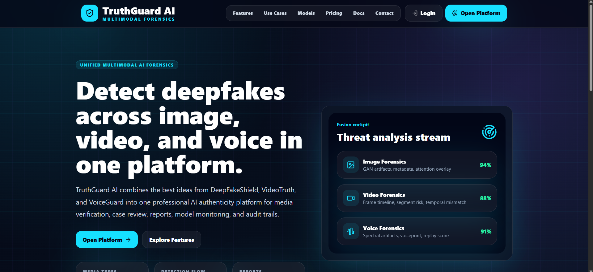

### Login Page

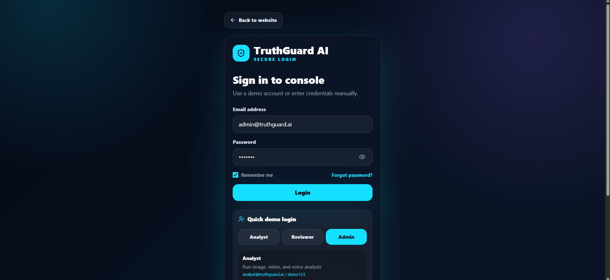

### Dashboard Overview

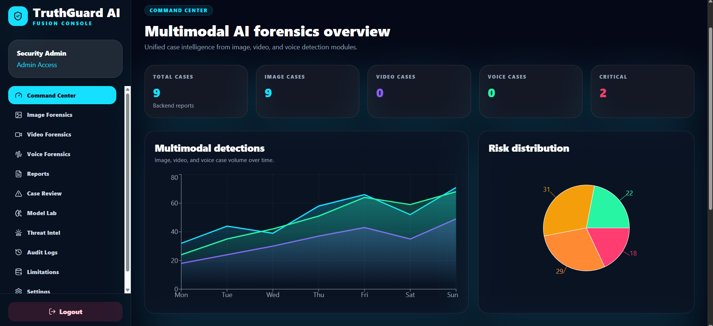

### Real Image Forensics Model Result

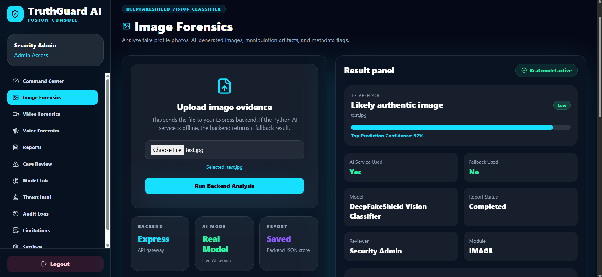

### Image Forensics Upload Workflow

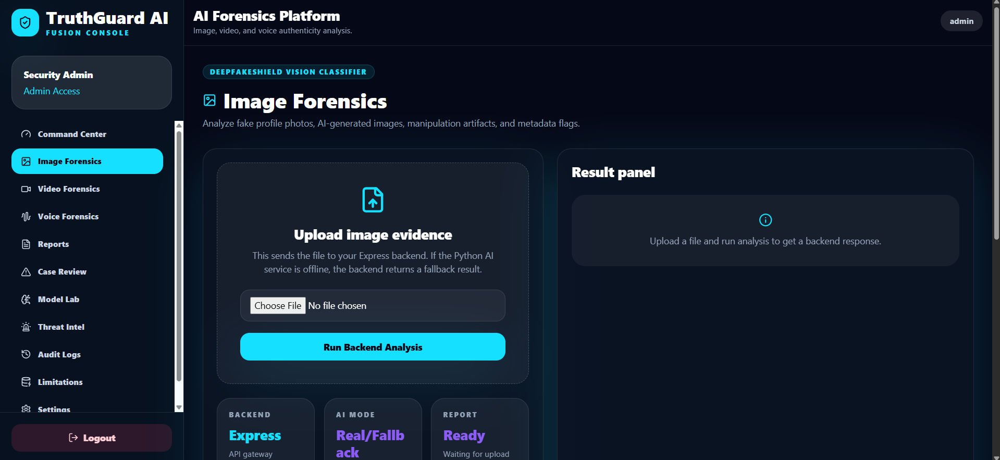

### Voice Forensics Upload Workflow

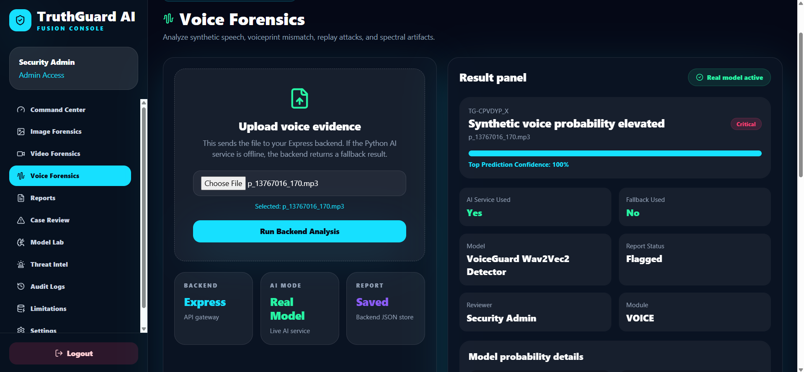

### Model Lab and AI Service Health

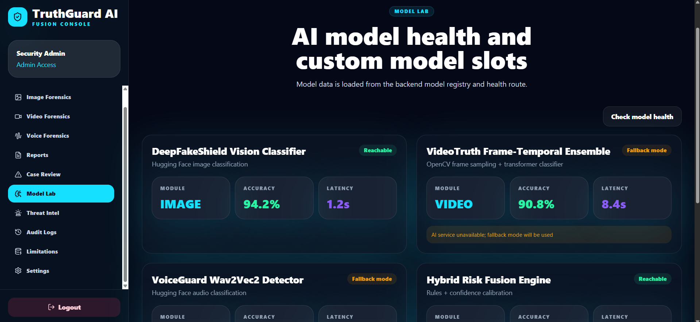

### Reports Management

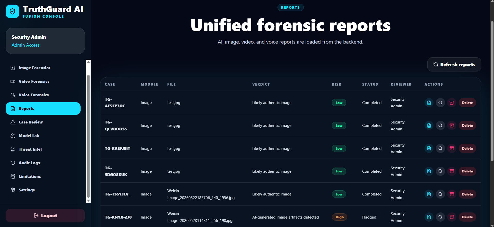

### Case Review Workflow

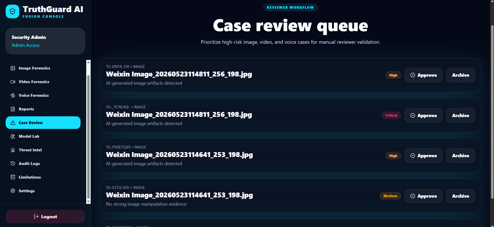

### Audit Logs

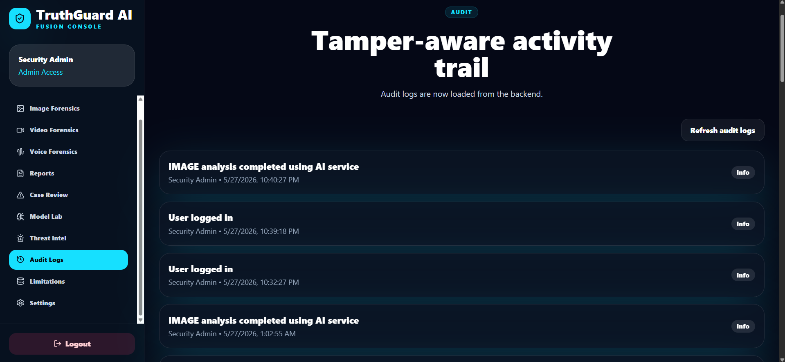

### Mobile Responsive View

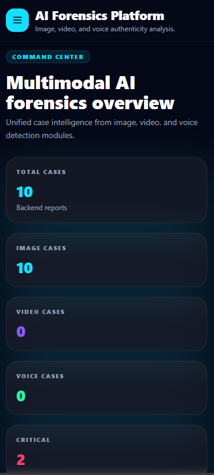

### Tablet Responsive View


## Tech Stack

### Frontend

- React
- TypeScript
- Vite
- Tailwind CSS
- React Router DOM
- Zustand
- Recharts
- Framer Motion
- Lucide React
- React Hot Toast

### Backend

- Node.js
- Express
- TypeScript
- JWT
- Multer
- Socket.IO
- Zod
- Axios
- Local JSON storage
- File upload handling

### AI Service

- Python
- FastAPI
- Hugging Face Transformers
- PyTorch
- Pillow
- Uvicorn

## Demo Accounts

```text
Analyst:
analyst@truthguard.ai / demo123

Reviewer:
reviewer@truthguard.ai / demo123

Admin:
admin@truthguard.ai / demo123
```

## How to Run the Project

You need to run **three terminals**:

```text
Terminal 1 → Image AI service
Terminal 2 → Backend API
Terminal 3 → Frontend
```

---

## 1. Run Image AI Service

Go to the image service folder:

```powershell
cd D:\truthguard-ai-multimodal-forensics\ai-services\image-service
```

Create and activate virtual environment:

```powershell
python -m venv venv
venv\Scripts\activate
```

Install dependencies:

```powershell
pip install -r requirements.txt
```

Create environment file:

```powershell
copy .env.example .env
```

Run the service:

```powershell
python main.py
```

Image service should run at:

```text
http://localhost:8001
```

Check health:

```text
http://localhost:8001/health
```

Expected result:

```json
{
  "status": "ok",
  "service": "truthguard-image-service",
  "modelLoaded": true
}
```

---

## 2. Run Backend

Go to backend folder:

```powershell
cd D:\truthguard-ai-multimodal-forensics\backend
```

Install dependencies:

```powershell
npm install
```

Create environment file:

```powershell
copy .env.example .env
```

Make sure backend `.env` has:

```env
PORT=5000
CLIENT_URL=http://localhost:5173
IMAGE_SERVICE_URL=http://localhost:8001
VIDEO_SERVICE_URL=http://localhost:8002
VOICE_SERVICE_URL=http://localhost:8003
JWT_SECRET=truthguard_super_secret_change_me
```

Run backend:

```powershell
npm run dev
```

Backend should run at:

```text
http://localhost:5000
```

Check backend health:

```text
http://localhost:5000/api/health
```

---

## 3. Run Frontend

Go to frontend folder:

```powershell
cd D:\truthguard-ai-multimodal-forensics\frontend
```

Install dependencies:

```powershell
npm install
```

Create frontend `.env`:

```env
VITE_API_BASE_URL=http://localhost:5000/api
```

Run frontend:

```powershell
npm run dev
```

Frontend should run at:

```text
http://localhost:5173
```

---

## Build Commands

### Frontend

```powershell
cd frontend
npm run build
```

### Backend

```powershell
cd backend
npm run build
```

## How to Confirm Real Image Model Is Working

Run the image service and backend, then check backend model health:

```powershell
$body = @{
  email = "admin@truthguard.ai"
  password = "demo123"
} | ConvertTo-Json

$login = Invoke-RestMethod `
  -Uri "http://localhost:5000/api/auth/login" `
  -Method POST `
  -ContentType "application/json" `
  -Body $body

$token = $login.data.token

Invoke-RestMethod `
  -Uri "http://localhost:5000/api/models/health" `
  -Method GET `
  -Headers @{ Authorization = "Bearer $token" } |
ConvertTo-Json -Depth 10
```

For the image model, you should see:

```json
{
  "id": "image-hf-vision",
  "serviceReachable": true
}
```

After uploading an image, the result should show:

```json
"aiServiceUsed": true,
"fallbackUsed": false
```

This means the real image model was used.

## Important Notes

- `node_modules/` is not uploaded to GitHub.
- `venv/` is not uploaded to GitHub.
- `.env` files are not uploaded to GitHub.
- `backend/uploads/` is not uploaded to GitHub.
- `backend/data/` is not uploaded to GitHub.
- Use `.env.example` files to show required configuration safely.
- Video and voice services are currently in fallback mode and can be added later.

## Future Improvements

- Add real voice deepfake detection service
- Add real video deepfake detection service
- Add PostgreSQL or MongoDB database
- Add Cloudinary/S3 upload storage
- Add PDF report export
- Add reviewer comments
- Add case assignment workflow
- Add Docker Compose setup
- Add deployment support for frontend, backend, and AI services
- Add model comparison dashboard
- Add Grad-CAM or attention visualization for image model explanation

## Author

**Nasir Uddin Khan**  
Frontend Developer | React, TypeScript & Full-Stack Web Application Enthusiast

Designed and developed as a professional portfolio project to demonstrate full-stack AI application development, real AI model integration, multimodal forensic UI, media upload workflow, model result visualization, reviewer workflow, audit logs, and responsible AI interface design.

- GitHub: [nasir050298](https://github.com/nasir050298)
- Email: nasiruddin@mails.cust.edu.cn
